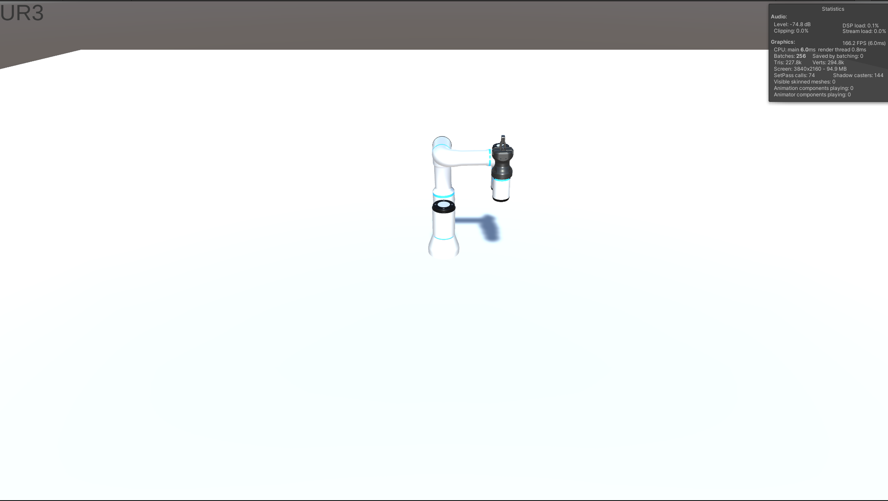
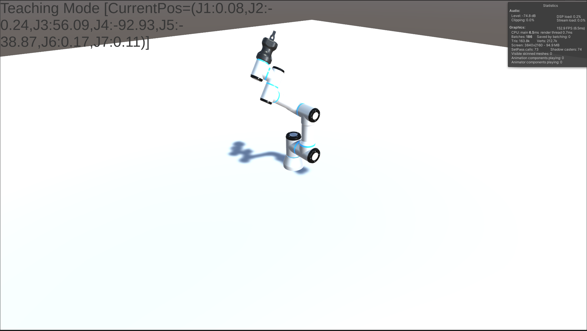
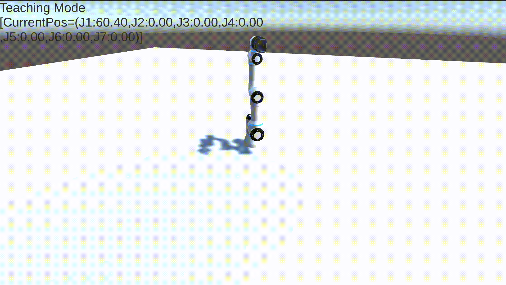

# RobotArmSimulator
## 개요
RobotArmSimulator는 Unity 환경에서 협동로봇을 직접 Simulating 하는 Project 입니다.
위 Project 에는 현재 3가지의 Example Job이 구현되어 있습니다.

### [SampleDirector](https://github.com/maroomir/RobotArmSimulator/blob/master/Assets/Scripts/SampleDirector.cs)

SampleDirector는 Motion Script의 작성 방법을 보여주는 Example Job 입니다.
Motion Script는 Robot의 동작을 지정하는 Script로서 이를 통해 RobotArm에게 원하는 동작을 지시할 수 있습니다.
설명을 위해 SampleDirector에 구현된 TechnoMotion의 예시를 가져오겠습니다.

```c#
    private IEnumerator TechnoMotionScript()
    {
        JointPoint pHomePos = JointPoint.Home();
        JointPoint pInitPos = JointPoint.FromPosition("InitPos", 0.0F, 0.0F, 90.0F, 90.0F, 0.0F, 0.0F, 180.0F);
        JointPoint pPos1 = JointPoint.FromPosition("Pos1", -90.0F, 0.0F, 45.0F, -90.0F, 45.0F, 90.0F, -90.0F);
        JointPoint pPos2 = JointPoint.FromPosition("Pos2", 90.0F, 0.0F, -45.0F, 90.0F, -45.0F, -90.0F, 90.0F);
        pInitPos.FrameCount = 100;
        yield return _pRobotControl.Move(pInitPos);
        yield return _pGripperControl.Close();
        pPos1.FrameCount = 100;
        yield return _pRobotControl.Move(pPos1);
        pPos1.FrameCount = 10;
        pPos2.FrameCount = 10;
        Thread.Sleep(2000);
        for (int i = 0; i < 20; i++)
        {
            yield return _pRobotControl.Move(pPos1);
            yield return _pRobotControl.Move(pPos2);
        }

        yield return _pRobotControl.Move(pHomePos);
        yield return _pGripperControl.Open();
    }
```
위 Script를 실행하면 아래처럼 Robot이 동작합니다.


몇가지 특징에 유념한다면 간단한 Motion Script를 쉽게 작성할 수 있습니다.

- Motion Script는 Coroutine으로 구현되어있습니다. 따라서 반드시 IEnumerator 형 함수로 작성해야합니다.
- 현재 구현 능력의 부족함으로 Rally Point는 Joint 좌표로만 작성합니다. 다만 Rally Point을 기준으로 한 상대적인 움직임은 X, Y, Z 좌표로 지정할 수 있습니다.
- Robot Arm이 똑바로 직립한 상태를 Home Position이라고 합니다. Home은 JointPoint에 static으로 구현되어 있기 때문에 쉽게 접근 가능합니다.
- Frame Count로 속도를 지정합니다. Frame Count의 의미는 해당 Point로 이동하는데 걸리는 Frame 수입니다. 따라서 실제 Robot Arm에서 사용하는 속도와 다릅니다.
- Robot Arm을 해당 Rally Point로 이동시키려면 Robot Component(_pRobotControl)에서 Move 함수를 사용하면 됩니다.
- Gripper 조작은 Gripper Component(_pGripperControl)를 통해 할 수 있습니다.

### [TeachingDirector](https://github.com/maroomir/RobotArmSimulator/blob/master/Assets/Scripts/TeachingDirector.cs)

TeachingDirector는 Robot Arm을 조작하여 Pose를 지정해서 MotionScript 작성 등에 활용하기 위해서 만들어진 Job 입니다.
TeachingDirector를 통해 지정된 Pose들은 JointPoint 형태로 변환되어 Points.json 으로 저장됩니다.
Robot Arm는 Keyboard 입력으로 조작이 가능합니다. 사용하는 Key 및 조합에 대해 아래에 적어두겠습니다.

#### 숫자 1 ~ 7 + 화살표 Key

각 Joint를 이동시키기 위한 Key 조합입니다. 왼쪽/위쪽 화살표 Key는 Robot의 Joint를 - 방향으로 회전시킵니다. 오른쪽/아래쪽 화살표 Key는 Robot의 Joint를 + 방향으로 회전시킵니다.

#### C + 화살표 Key

Camera를 이동시키기 위한 Key 조합입니다. Robot이 서있는 위치를 기준으로 화살표 방향에 맞게 Camera가 회전합니다.
Robot의 Tool 위치를 Tracking 하거나, 간섭을 피하면서 Pose를 지정하기 위해 사용합니다.

#### R, G Key

Gripper를 Release(R) 하거나 Grip(G) 하기 위해 사용하는 Gripper 조작 Key입니다.

#### Spacebar Key
현재 Robot Arm의 Pose를 보정하기 위해 Spacebar를 누릅니다. 현재 실수 형태로 이뤄져있는 위치값들을 가독성이 좋은 정수 형태로 바꾸기 위해 사용합니다. 

#### Enter Key
현재 Robot Arm의 Pose를 JointPoint로 변환해서 .json 파일에 저장합니다.

#### Shift + H 또는 숫자 0
Robot Arm을 직립 상태인 영점(0), 또는 Home(H) 위치로 이동시킵니다.

#### Shift + R
현재까지 저장된 Pose들을 재생(Replay)해서 확인할 수 있습니다. Robot Arm은 가장 먼저 Home 위치로 이동한 다음에 저장된 위치값대로 차례대로 Pose를 취합니다.

#### ESC Key
재생 Mode, Pose 저장 등 다른 Job 상태에서 Teaching Mode로 돌아가기 위해 사용합니다.

### [PlayDirector](https://github.com/maroomir/RobotArmSimulator/blob/master/Assets/Scripts/PlayDirector.cs)
PlayDirector는 Teaching으로 저장된 Point들을 실제로 돌려보기 위해 만들어진 Test 전용 Job입니다.
PlayDirector에 검증을 원하는 .json 파일을 삽입하면, 번호 순서대로 로봇에서 Job을 실행합니다.
이를 통해 지정한 Pose들을 검토해보고, 실제 Motion Script를 작성할 때 참고할 수 있습니다.

## 사용 전 주의사항
아직 Unity와 Robot 제어에 대한 이해가 부족해서 시중에 판매하는 협동로봇보다 부족한 점이 많습니다. 이런 점들은 천천히 공부하면서 구현하도록 하겠습니다.

## 참고
RobotArm의 Resource는 Unity에서 공개한 [articulations-robot-demo](https://github.com/Unity-Technologies/articulations-robot-demo) 에 포함된 [UR3](https://www.universal-robots.com/products/ur3-robot/) 와 [HandE](https://robotiq.com/products/hand-e-adaptive-robot-gripper) 를 가져왔습니다.